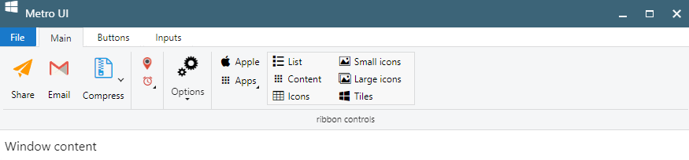

# Ribbon Menu for React

### Ribbon Menu - is a command bar that organizes a program's features into a series of tabs.

In computer interface design, a ribbon is a graphical control element in the form of a set of toolbars placed on several tabs. 
The typical structure of a ribbon includes large, tabbed toolbars, filled with graphical buttons and other graphical control elements, grouped by functionality. 
Such ribbons use tabs to expose different sets of controls, eliminating the need for numerous parallel toolbars. 
Contextual tabs are tabs that appear only when the user needs them.

## Component sponsored by [Giovanni Tummarello](g.tummarello@octostar.co)

